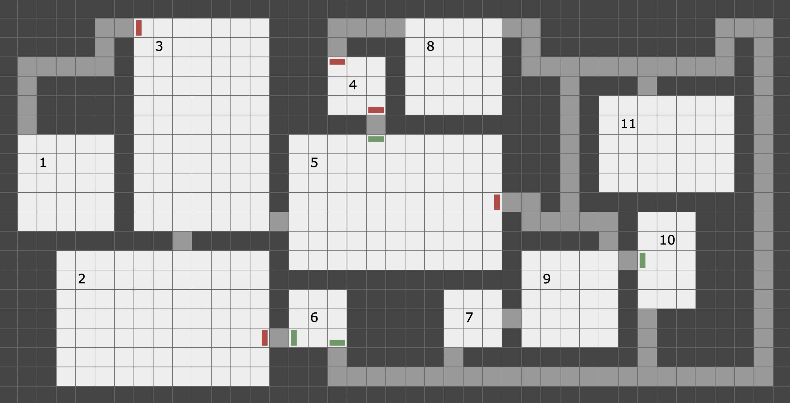
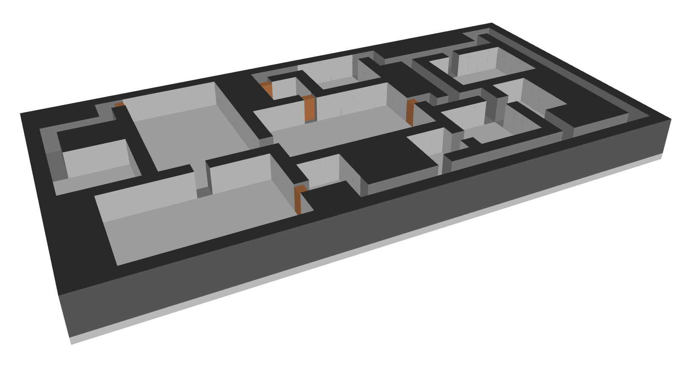
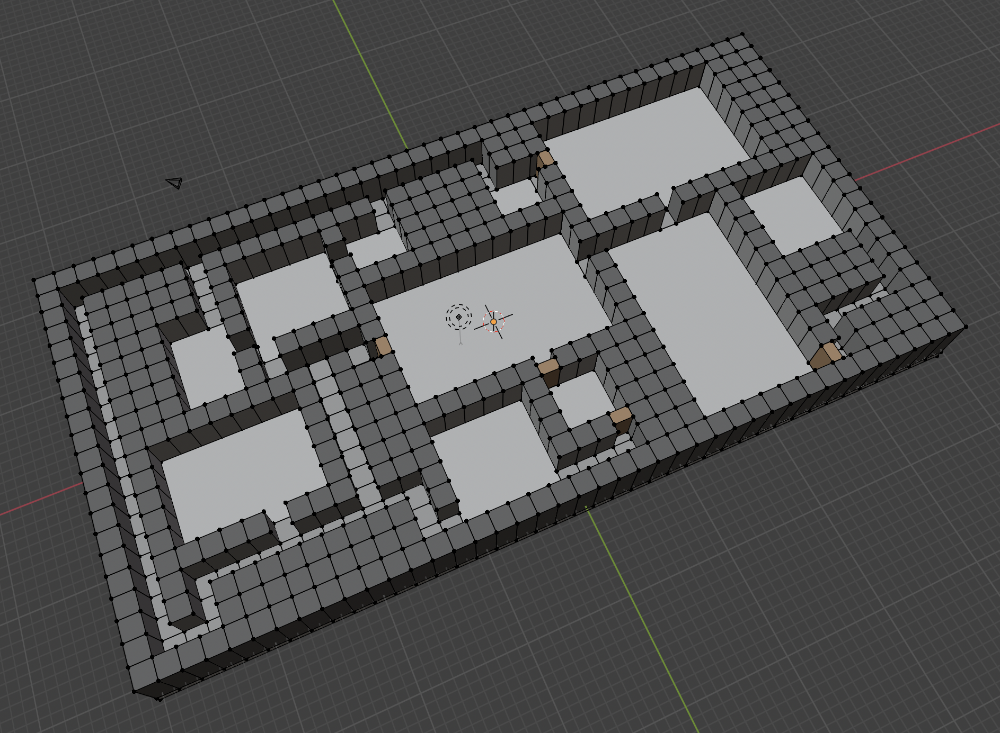
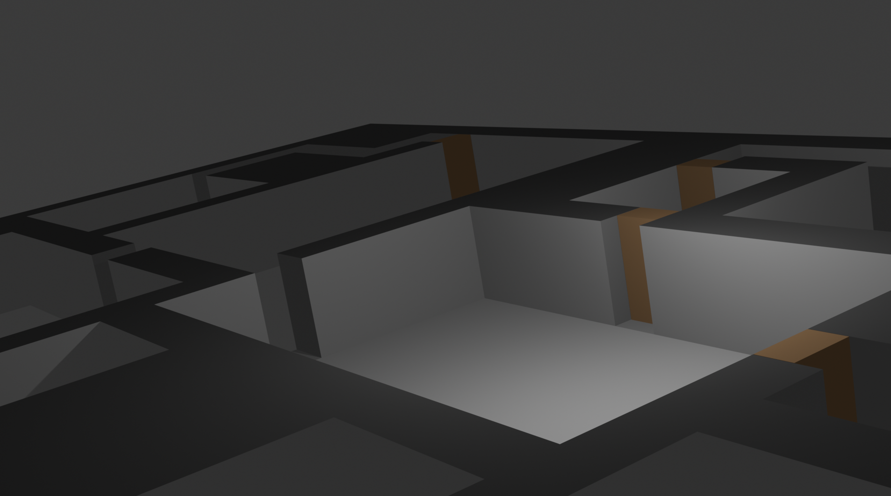

# DUNGEON

**Generates and renders dungeons in 2D, with 3D exports as Wavefront (.obj) files.**

*Whilst dungeons are random, they are iterated over in order to produce sensible, well connected layouts with minimal redundancy or winding.*

Screenshots of the output are included further down.

Copyright 2025, K Cartlidge. [Licensed as *AGPL-3.0-only*](./LICENSE.txt).

## Features

- Generate both random and repeatable dungeons
- Choose the dungeon size and the scaling
- Set how frequently rooms will appear
- Generates SVG files for use in browsers and by drawing packages
- Generates OBJ files for use in 3D apps like Blender
    - Includes material file to maintain the look
    - Optionally seal the top (for use in a game)
- Extremely fast on modern machines
- Reasonably well explained code

## Contents

- [Running](#running)
    - [Options](#options)
- [The Outputs](#the-outputs)
    - [Screenshots of examples](#screenshots-of-examples)
    - [2D Viewing](#2d-viewing)
    - [3D Viewing](#3d-viewing)
    - [Using in Other Software](#using-in-other-software)
- [Legal](#legal)

## Running

```bash
cd Dungeon
dotnet run -- -cellsize 36 -seed 65536 -filename dungeon.svg -width 41 -height 21
```

### Options

| Option | Example | Purpose |
|:------ |:------- |:------- |
| `seed` | `65536` | Random seed for dungeon generation |
| `width` | `41` | Width of the dungeon  (default `41`) |
| `height` | `21` | Height of the dungeon (default `21`) |
| `cellsize` | `32` | Size of each cell in pixels (default `32`) |
| `rooms` | `dense` | Rough room frequency (see below) |
| `filename` | `dungeon.svg` | Output filename (default `dungeon.svg`) |
| `3d-floor` | | The 3D model is sealed with extra flooring |
| `3d-roof` | | The 3D model is sealed with a roof |

- Rooms supports `default`, `dense`, or `sparse`
- All output files are based on the SVG filename with the extention switched
- The 3D output always includes floors; the `3d-floor` flag adds an extra single solid slab underneath it
    - This increases the rigidity if the `obj` file is used for 3D printing
- By default the top of the dungeon is open so you can see inside; the `3d-roof` flag adds a solid slab over the top to enclose it for use in games

## The Outputs

The program generates several output files:

- SVG files for 2D visualization
- OBJ and MTL files for 3D visualization
- JSON file (for debugging only)

### Screenshots of examples

The 2D image below is rendered directly as SVG:



The 3D image below is the generated `.obj` file (rendered via [https://3dviewer.net/](https://3dviewer.net/)):



Here's a screenshot of the same `.obj` file imported (with the `.mtl`) and shown in *Modelling* mode in *Blender*:



And here's a screenshot of the same `.obj` file imported (with the `.mtl`) as a very basic *Render* in *Blender*:



### 2D Viewing

The SVG files can be viewed in any web browser or SVG viewer, or opened in most drawing packages (eg *Affinity Designer*).

### 3D Viewing

To view the 3D model:

1. Go to [https://3dviewer.net/](https://3dviewer.net/)
2. Drag and drop both the `.obj` and `.mtl` files onto the viewer
3. Use the mouse to rotate, pan, and zoom

To view without materials but with an option to purchase a 3D print:

1. Go to [https://www.sculpteo.com/en/upload/](https://www.sculpteo.com/en/upload/)
2. Drag and drop the `.obj` file onto the viewer
3. Use the mouse to rotate, pan, and zoom

This latter site supports cutaway viewing, which allows you to drag a cutaway point along the length of the maze and see it in cross-section.  This is useful for checking depths during render routine development for example.

### Using in Other Software

- Import it as a *Wavefront OBJ* file in, for example, *Blender*
- The generated `.obj` dungeon model has (0,0,0) at the exact centre
    - This places it's centre of rotation right in the middle

## Legal

Copyright 2025, K Cartlidge. [Licensed as *AGPL-3.0-only*](./LICENSE.txt).

This basically means you can do what you like with it provided you:

- maintain attribution and copyright notices in the code
- don't change the license
- do advise of any changes
- don't offer it as a service over the network

Obviously any generated dungeons and output files are entirely yours.
